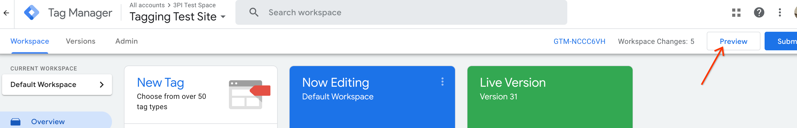
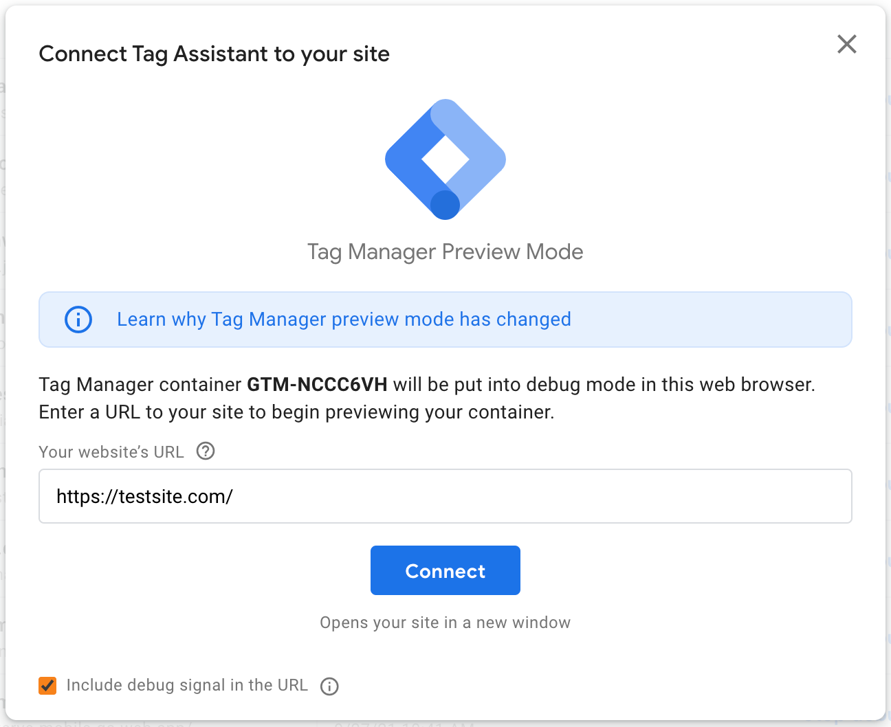
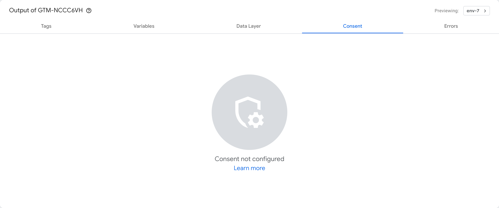

# About This Template
This template is a reference implementation meant to demonstrate how Tag Manager triggers and variables can be used to manage Consent Mode consent states in place of a CMP-provided template. It is provided as a proof of concept with no warranties or support. Google recommends utilizing the template provided by your CMP, if one is available.
# Before You Begin
Review the Consent Mode documentation here, paying close attention to the section titled “Consent Mode behavior”. You will need this information to make your selections during tag setup.

This template assumes that your CMP or consent banner provides a way to trigger tag firing in Tag Manager when users provide consent. Your CMP should provide instructions for setting up an appropriate trigger and variable to fire tags in Tag Manager. Please refer to your CMP’s documentation for instructions on how to set these up.
# Instructions For Use
## Importing the template
1. Download all files from this repository
2. Unzip the .zip file
3. In Google Tag Manager, go to the Templates section on the left side of the screen
4. Click New
5. Click Import
6. Locate the .tpl file from the ZIP file you downloaded
7. Save the template
## Creating the tags
1. Use this template to create two tags, one which is configured with the Default command, and one which is configured with the Update command.
2. Configure the Default command tag to fire on the Consent Initialization trigger, and set the default settings according to your organization's requirements. Note: This template does not configure URL Passthrough behavior. Please see here for more information on URL Passthrough and instructions on how to configure it on your site if needed.
3. Configure the Update command tag to fire on a trigger that executes when consent changes. Set the consent states for each consent type in the update settings using a variable or variables that return "granted" when the visitor has consented to the corresponding consent type and "denied" when the visitor has not consented. If you are using triggers and variables to fire Google tags today, the same triggers and variables can likely be reused for firing the Update command tag. Please consult your CMP’s documentation for information on creating an appropriate trigger and variable.

**IMPORTANT:** Failure to properly configure two copies of this tag as described will result in undesirable tag behavior. If you use a CMP which offers their own GTM template, please use the CMP-provided template.

## Verifying Your Implementation
Use Google’s Tag Assistant tool to verify your implementation after it is completed and before you publish your changes. Perform the following steps to verify your implementation:

1. Open an Incognito window in your browser, and navigate to Tag Manager.
1. In Tag Manager, click Preview in the top right corner

1. When the Tag Assistant tool opens, enter the URL for your website or development environment. Do not interact with the consent banner.

1. After the page loads, click the Consent event immediately after Consent Initialization on the left sidebar of your Tag Assistant window. In the content pane on the right half of the page, choose the Consent tab.

1. Verify that the consent states are set according to the settings you provided in the consent template configuration.
1. On the left sidebar of Tag Assistant, navigate to the first event where Google tags are set to fire. Switch to the Consent tab.
1. Verify that the consent states are set according to the settings you provided in the consent template configuration.
1. Repeat steps 6-7 for each additional event where Google tags are set to fire. If Google tags fire on user interaction as well, complete the user interaction(s) that trigger Google tags and verify that your configured consent settings were in place for each of those events.
1. Grant consent via your consent banner and reload the page. Repeat steps 4-8, ensuring that the new consent you provided via the banner is reflected instead of the default consent that was configured.
1. Follow your CMP’s instructions to update your consent, changing it from what you selected in step 9. Reload the page. Repeat steps 4-8, ensuring that the new consent you provided is reflected on each event where Google tags are fired.

## Common Issues & Solutions

**Issue:** The Consent tab shows “Consent not configured”

**Solution:** Ensure that you have configured one copy of the template using the Default command and Default settings (step 2 above), and that you have set it up to fire on the Consent Initialization event.

**Issue:** I interacted with my banner, but the Consent tab does not reflect the changes I made on subsequent events.

**Solution:** Only events that happen after your banner interaction will show your updated consent. If you are seeing that events after the banner interaction are not reflecting your consent change, please double check the implementation of your Update command tag (step 3 above). Things to check:

- Ensure your tag is set to fire on a custom trigger based on an appropriate data layer event published by your CMP. The data layer event should be pushed after every consent change.
- Ensure you are using a custom variable to populate each of the consent states in the update tag. The custom variable should return “granted” when consent was given and “denied” when it was not. If you are unsure how to determine when consent was given or not, please consult with your CMP’s documentation or support team.
- If you’ve confirmed that your custom trigger and variables are set up correctly, try increasing the Wait For Update value in your Default command tag. This value provides more time for CMPs to communicate updates before Google tags are fired. Typical values range from 500 to 2000 milliseconds.
